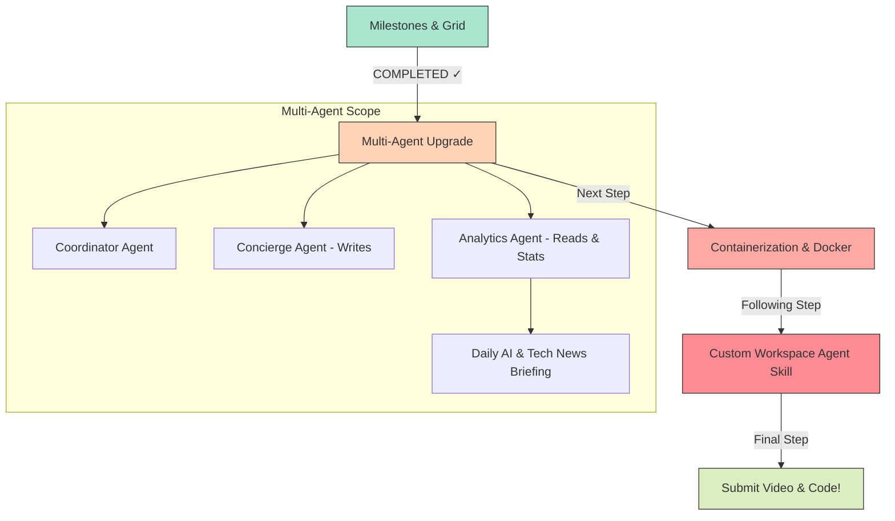

# SyncRoutine — Capstone Progress & Implementation Plan

Welcome back! The implementation of **Milestones & Progress Analytics** has been completed. 

The database migrated flawlessly on startup, all backend routes are actively bound, the dynamic progress formulas are calculating correctly, and your backups are structured.

---

## 1. State of the Codebase: Is Everything OK?

> [!IMPORTANT]
> **Yes! The application is in a fully operational state.**

The following verifications have been automatically run and passed:
1.  **Database Migration**: The SQLite system automatically initialized the `milestones` table. Startup server logs output: `[DB] Milestones table verified ✓`.
2.  **Route Binding**: The Express server successfully mounted `/api/milestones` and bound all CRUD routes (`GET`, `POST`, `PUT`, `DELETE`).
3.  **Client-Side Integration**: The Single Page Application (`public/index.html`, `public/app.js`, `public/style.css`) successfully integrates:
    *   A dynamic dashboard grid for milestones showing automated metric computations (`hours`, `days`, etc.) and manual values (`words`, `lessons`, `calories`).
    *   An elegant, high-fidelity CSS design with animated progress bars, gradient themes (violet, teal, orange, magenta), hover transitions, and a solid green completion-glow state.
4.  **Automatic Backup Created**: We have compiled a fresh, comprehensive backup of this working state in `backups/backup_fourth/`, fully isolated from Git and Docker.

---

## 2. Capstone Requirements Progress Tracker

By implementing the Milestones system, we are on the verge of satisfying all requirements for the **Kaggle AI Agents Capstone Project (Track 3)**. Below is the updated progress report:

| Capstone Requirement | Status | Feature Verification | How You Demonstrate It |
| :--- | :--- | :--- | :--- |
| **Concept 1: Multi-Agent System** | 🟡 *Ready to Implement* | `agent.js` | We will upgrade `agent.js` into an **Agent Coordinator** routing calls between a *Concierge Agent* (writes/confirmations) and an *Analytics & Briefing Agent* (reads/trends + daily AI news). |
| **Concept 2: MCP Server** | 🟢 **COMPLETED ✓** | `mcp-server.js` | Exposes local database queries (`get_wellness_summary`, `add_activity_log`, `get_pending_tasks`) as tools over standard I/O for external agents. |
| **Concept 3: Antigravity Customizations** | 🟢 **COMPLETED ✓** | `.agents/AGENTS.md` | Workspace rules defined to guide coding agents on database transactions, security, and styles. |
| **Concept 4: Security & Privacy** | 🟢 **COMPLETED ✓** | `db.js` | Journal entries are cryptographically encrypted at rest via native `AES-256-CBC` and decrypted on retrieval. |
| **Concept 5: Deployability** | 🟡 *Pending* | `Dockerfile`, `docker-compose.yml` | We will add standard, ultra-lightweight Docker files for seamless cloud hosting. |
| **Concept 6: Agent Skills** | 🟡 *Pending* | `.agents/skills/...` | We will write a workspace-scoped skill file explaining how to manage, backup, and sync SQLite to GCS. |

---

## 3. Updated Implementation Roadmap

To finish the capstone with distinction, we will follow this incremental blueprint:



---

## 4. Prompt for Zone-it (Cloud Zone-it 4.6)

Copy and paste the exact, high-fidelity prompt below into your **Zone-it IDE Chat** to let your Sonnet 4.6-powered agent upgrade `agent.js` into a robust Multi-Agent Coordinator!

```markdown
Let's upgrade our Gemini AI engine in `agent.js` to implement a robust Multi-Agent Coordinator System (Capstone Concept 1).

We want to divide the single general assistant into a Coordinator-sub-agent layout. Here is the architecture:

1. THE COORDINATOR AGENT (Classifier)
- Reads the user message and context snapshot.
- Classifies the user's intent into one of our standard INTENTS:
  - Writes: `LOG_ACTIVITY`, `CREATE_TASK`, `ADD_SCHEDULE`, `LOG_JOURNAL`, `LOG_MEDAL`
  - Reads/Queries: `QUERY_DATA`, `GENERAL_CHAT`
- Routes the request to the correct sub-agent.

2. THE CONCIERGE AGENT (Handles Writes)
- This agent's persona is warm, supportive, and extremely concise (1-2 sentences).
- For all write intents, it validates the parameters and sets:
  "requiresConfirmation": true
- This triggers our UI modal so the user can verify the payload before it commits to the database.

3. THE ANALYTICS & BRIEFING AGENT (Handles Reads/Chat)
- This agent's persona is analytical, encouraging, and informative.
- For `QUERY_DATA` or `GENERAL_CHAT`, it scans the last 7 days of logs (context) and computes helpful wellness averages or summaries.
- IMPORTANT: At the bottom of its response, it MUST append a dedicated "Daily AI & Tech News Briefing" section. This must contain 2 bullet points highlighting a fictional or real recent exciting breakthrough in AI or tech (to satisfy our custom app briefing feature).
- It sets "requiresConfirmation": false since no database modifications are needed.

4. GEMINI API JSON MODE & RELIABILITY
- To prevent syntax parser failures, configure the `genAI.getGenerativeModel` call or `generateContent` configuration with structured JSON Mode:
  generationConfig: { responseMimeType: "application/json" }
- Ensure the prompt contains a highly rigid JSON schema specifying:
  {
    "intent": string,
    "reply": string,
    "requiresConfirmation": boolean,
    "payload": object
  }
- Keep our existing local `regexFallback` intact and unchanged so the app functions gracefully on network or API key failures.

Please modify `agent.js` to implement this design cleanly and robustly. Ensure all syntax remains perfectly correct.
```

---

## 5. How to Restore Backups
If you ever want to reset the code to a pristine state, refer to your local backups:
*   **Backup Third (Before Milestones)**: Available at `backups/backup_third/`.
*   **Backup Fourth (After Milestones, Pre-Multi-Agent)**: Available at `backups/backup_fourth/`.
